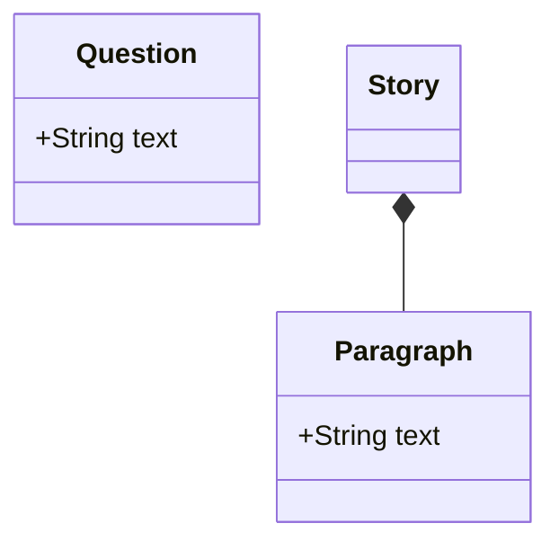
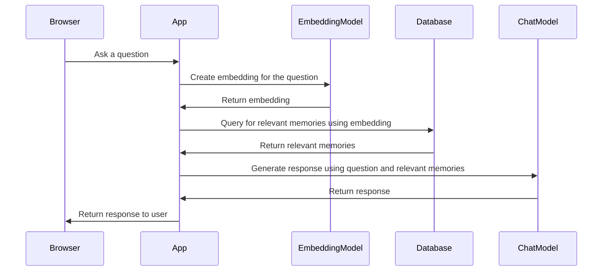

# Architecture

The vision is a system that indepedent of online services, running on its own hardware, can chat about life based on a person's memories.

## Quality attributes

### Security
Local models to avoid dependency on online services. The latter can be used for comparison and benchmarking.

### Testability
Use Docker for easy setup when developing and testing. 

## Description

### Logical view
The user asks a question which is compared to the story. The story consists paragraphs that represent memory fragments. The question and the story are processed by a language model to generate a response.

### Deployment for testing and development (Physical view)
See [docker-compose.yml](core/docker-compose.yml) for details. 

The main application is built using Spring Boot and runs in a Docker container. It is responsible for handling user interactions and managing the overall functionality of the system.

Ollama runs in another container and provides the AI models for embeddings and chatting. First Ollama starts and then the models are downloaded once.

The database is Postgres with a vector extension and runs in a third container. The memories are stored as paragraphs in the relational database and the embeddings are stored in the vector extension.

### Code structure (Development view)

#### API ([api](core/src/main/java/se/minnesladan/core/api))
REST interfaces for the app.

#### Database ([database](core/src/main/java/se/minnesladan/core/database))
Defines database entities and repositories.

#### LLM ([llm](core/src/main/java/se/minnesladan/core/llm))
Selection and access to LLM for embeddings and chatting.

#### Service ([service](core/src/main/java/se/minnesladan/core/service))
Domain logic and orchestration of the app.

#### Static ([static](core/src/main/resources/static))
User interface.

### Process view
When the user asks a question, it is first processed by the embedding model which creates a vector representation of the question. This vector is then used to query the database for relevant memories based on their embeddings. The retrieved memories are then passed to the chat model along with the original question to generate a response. The response is then returned to the user.

